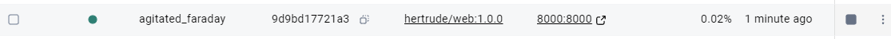

# Docker, Kubernetes Web Server. Доступ через Service NodePort

## Аннотация последовательности действий
Сначала был создан Docker image на базе `python:3.14-alpine`, содержащий файл `hello.html` с текстом `Hello world` и запускающий web-сервер командой `python -m http.server 8000`. Затем полученный image был размещён на Docker Hub. После этого был создан Kubernetes Deployment с двумя репликами и probes, установлен в кластер Kubernetes, и был обеспечен доступ к web-приложению через Kubernetes Service типа NodePort. Далее была выполнена проверка доступности страницы `hello.html` через curl

---

## Структура репозитория
- `Dockerfile` — сборка Docker image
- `hello.html` — страница приложения с текстом `Hello world`
- `k8s/deployment-web.yaml` — Kubernetes Deployment manifest (Deployment `web`, replicas `2`, probes)
- `k8s/service-web-nodeport.yaml` — Kubernetes Service manifest типа NodePort
- `outputs/kubectl-describe-deployment-web.txt` — результат команды `kubectl describe deployment web`
- `outputs/curl.txt` — результат команды `curl.exe`, подтверждающий доступ к приложению

---

## Dockerfile

используется базовый образ python:3.14-alpine, создаётся каталог /app и назначается как WORKDIR, файл hello.html копируется в /app. web-сервер запускается от имени пользователя с uid 10001, запускается командой python -m http.server 8000

## сборка Docker image (hertrude/1.0.0)

docker build -t hertrude/web:1.0.0

docker run --rm -p 8000:8000 hertrude/web:1.0.0

проверим с помощью команды
curl http://127.0.0.1:8000/hello.html

## размещение image на Docker Hub

docker login
docker tag web:1.0.0 hertrude/web:1.0.0
docker push hertrude/web:1.0.0

## Kubernetes Deployment manifest (web, две реплики, probes)

Создаю k8s/deployment-web.yaml

имя Deployment: web
количество реплик: 2
используется image hertrude/web:1.0.0
добавлены livenessProbe и readinessProbe на GET /hello.html (порт 8000)

## Установка Deployment в кластер:

PS C:\Users\rictus\projects\Kubernetes_example> minikube start
kubectl config use-context minikube
kubectl cluster-info
kubectl apply -f k8s/deployment-web.yaml

Проверка статуса:

kubectl rollout status deployment/web
kubectl get pods -l app=web

Результат выполнения
kubectl describe deployment web

outputs\kubectl-describe-deployment-web.txt

## обеспечение доступа к приложению через Service NodePort

Был создан файл k8s/service-web-nodeport.yaml типа NodePort, направляющий трафик на Pods Deployment web по метке app=web

### Установка Service:

kubectl apply -f k8s/service-web-nodeport.yaml
kubectl get svc web -o wide

### Получение Node IP в Minikube

Node IP для доступа к NodePort был получен командой:

minikube service web --url

### Доступ к приложению

После получения IP адреса Minikube доступ к странице выполнялся по адресу:

http://127.0.0.1:52290/hello.html

### Проверка работоспособности через curl

curl http://127.0.0.1:52290/hello.html

Файл outputs/curl.txt

